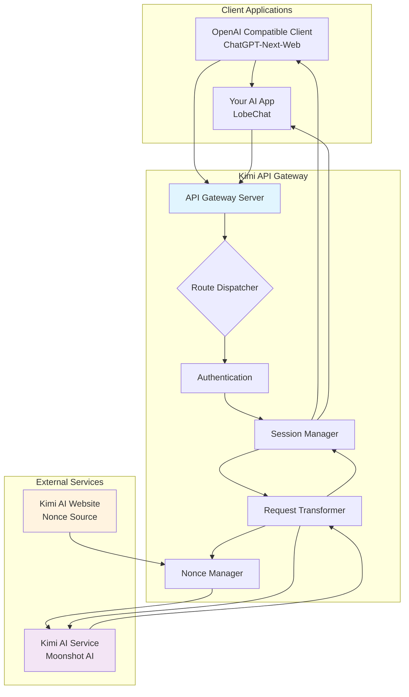
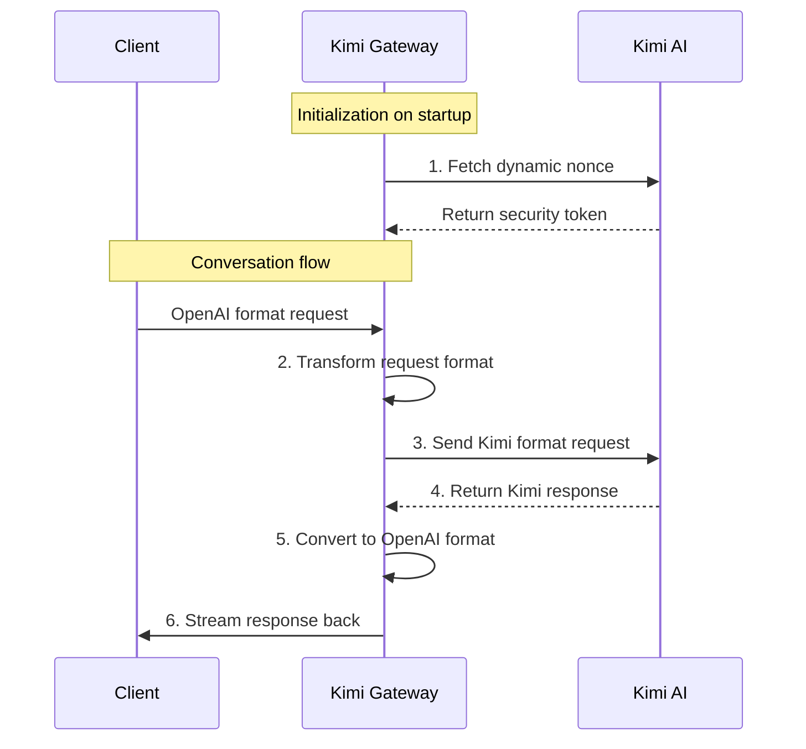

# 🚀 Kimi AI to OpenAI API Gateway

> **Your Personal Kimi AI Gateway | Open Source, High Performance, OpenAI Compatible**

[](https://opensource.org/licenses/Apache-2.0)
[](https://deno.land)
[](https://github.com/Kirazul/kimi-deploy)
[](https://github.com/ellerbrock/open-source-badges/)

> **"Standing on the shoulders of giants, not just to see further, but to explore the stars together. This project is your personal bridge to the Kimi AI giant."**

Welcome to the world of Kimi AI Gateway! This project converts the powerful [Kimi AI](https://kimi.ai) chat service into a fully **OpenAI API compatible** interface.

This means you can use the vast ecosystem of tools, applications, and libraries built for OpenAI to seamlessly access Kimi's **ultra-long context processing capabilities**!

---

## ✨ Core Features

### 🚀 High Performance
Built on Deno and Rust technology stack, far exceeding traditional Python scripts with fast startup and low memory footprint.

### 🛡️ Secure & Reliable
Deno's default security model makes it clear what permissions your script needs (`--allow-net`, `--allow-env`).

### 🔄 Full OpenAI Compatibility
Perfect emulation of `/v1/chat/completions` and `/v1/models` endpoints with streaming support for seamless migration of existing applications.

### 💬 Stateful Conversations
Multi-user session management that maintains independent conversation contexts for different users, enabling true continuous dialogue.

---

## 🎯 What Can It Do?

### 📚 Personal Knowledge Base Q&A
Feed your long documents, novels, or codebases to Kimi and query them through any OpenAI client for deep analysis.

### 🔧 Development Integration
Use familiar OpenAI SDKs in your own applications to directly access Kimi's powerful capabilities without learning a new API.

### 🎓 Academic Research
Researchers dealing with large volumes of text, papers, and materials can quickly build powerful long-text analysis assistants.

### 🧪 Learning & Exploration
For those interested in API proxies, Deno development, and web technologies, this is a complete practical project.

---

## 🏗️ System Architecture



---

## ⚡ Quick Start

### 🌐 Option 1: Deploy to Deno Deploy (Recommended)

**The easiest cloud deployment method, completely free!**

1. **Fork this project to your GitHub account**
   - Visit [https://github.com/Kirazul/kimi-deploy](https://github.com/Kirazul/kimi-deploy)
   - Click the "Fork" button in the top right

2. **Login to Deno Deploy**
   - Visit [https://deno.com/deploy](https://deno.com/deploy)
   - Sign in with your GitHub account

3. **Create a new project**
   - Click "New Project"
   - Select your forked repository `kimi-deploy`
   - Choose `main.ts` as the entry file

4. **Configure environment variables**
   - Add environment variables in project settings:
     - `API_MASTER_KEY`: Your API key (strongly recommended to change!)
     - `PORT`: Leave empty (Deno Deploy handles this automatically)
     - `SESSION_CACHE_TTL`: `3600` (optional)

5. **Deployment complete!**
   - Deno Deploy will automatically deploy and provide an HTTPS URL
   - Use the provided URL + `/v1` as your API endpoint

**Example configuration:**
- **API URL**: `https://your-project.deno.dev/v1`
- **API Key**: Your configured `API_MASTER_KEY`
- **Models**: `kimi-k2-instruct-0905` or `kimi-k2-instruct`

---

### 💻 Option 2: Run Locally

#### Step 1: Install Deno

**macOS / Linux:**
```bash
curl -fsSL https://deno.land/x/install/install.sh | sh
```

**Windows (PowerShell):**
```powershell
irm https://deno.land/x/install/install.ps1 | iex
```

#### Step 2: Clone the project
```bash
git clone https://github.com/Kirazul/kimi-deploy.git
cd kimi-deploy
```

#### Step 3: Configure environment
Copy `.env.example` to `.env` and modify the configuration:
```env
# Security configuration - strongly recommended to change!
API_MASTER_KEY=sk-your-secret-key-123456

# Service configuration
PORT=8088

# Session management
SESSION_CACHE_TTL=3600
```

#### Step 4: Start the service
```bash
deno task start
# Or use development mode (auto-reload)
deno task dev
```

Success output:
```
kimi-ai-2api-deno v1.0.0 starting...
Initializing KimiAIProvider, fetching nonce for the first time...
Successfully fetched new nonce: xxxxxxxxx
Service started, listening on http://localhost:8088
```

#### Step 5: Configure your client
Configure any OpenAI API compatible client with:

- **API URL**: `http://localhost:8088/v1`
- **API Key**: Your `API_MASTER_KEY` from `.env`
- **Models**: `kimi-k2-instruct-0905` or `kimi-k2-instruct`

---

## 🔧 Technical Details

### Core Working Principle



### Key Technical Features

| Component | Importance | Description | Improvement Direction |
|---------|--------|------|----------|
| **Deno Runtime** | ⭐⭐⭐⭐⭐ | Secure, modern TypeScript runtime with no complex dependencies | Ecosystem continuously improving |
| **Nonce Management** | ⭐⭐⭐⭐☆ | Dynamic security token fetching with retry support | Explore more stable acquisition methods |
| **Session Cache** | ⭐⭐⭐☆☆ | In-memory session management with TTL expiration | Redis persistence support |
| **Streaming Response** | ⭐⭐⭐⭐☆ | OpenAI SSE format simulation with character-by-character output | Implement true streaming |
| **Request Transformation** | ⭐⭐⭐⭐⭐ | Complete API format conversion engine | Support more endpoints |

---

## 📁 Project Structure

```
kimi-deploy/
├── 📄 main.ts                 # Core entry file
├── 📄 .env                    # Environment configuration
├── 📄 .env.example            # Environment template
├── 📄 deno.json               # Deno configuration
├── � RyEADME.md               # Project documentation
├── 📄 LICENSE                 # Apache 2.0 License
└── 📄 .gitignore              # Git ignore rules
```

---

## 🗺️ Roadmap

### ✅ Completed Features
- [x] **Core Proxy Functionality** - Complete OpenAI to Kimi conversion
- [x] **Streaming Response Simulation** - OpenAI SSE format compatible
- [x] **Multi-user Sessions** - Memory-based context management
- [x] **Security Verification** - API key protection mechanism
- [x] **Model Listing** - `/v1/models` endpoint simulation

### 🔄 In Progress
- [ ] **Nonce Stability** - Explore more reliable acquisition methods
- [ ] **Error Handling** - More granular upstream error propagation
- [ ] **Performance Optimization** - Request processing and caching mechanisms

### 🚀 Future Plans
- [ ] **True Streaming** - Low-latency real-time responses
- [ ] **Persistent Sessions** - Redis/SQLite support
- [ ] **Dockerization** - Containerized deployment solution
- [ ] **Web UI** - Management interface and testing tools
- [ ] **Multi-account Load Balancing** - Break through rate limits

---

## 🤝 Contributing

We believe in the power of open source! Every line of code, every thought, makes the world a better place.

**How to contribute:**

1. **Report Issues** - Submit bugs or suggestions in GitHub Issues
2. **Feature Development** - Claim development tasks and submit Pull Requests
3. **Documentation** - Improve docs to help more users
4. **Testing** - Test new features and ensure stability

**Development setup:**
```bash
# Clone the project
git clone https://github.com/Kirazul/kimi-deploy.git
cd kimi-deploy

# Cache dependencies
deno cache main.ts

# Start development server
deno task dev
```

---

## 📜 License

This project is licensed under the **Apache 2.0 License** - you are free to use, modify, and distribute it under the terms of the license.

[View full license](https://opensource.org/licenses/Apache-2.0)

---

## 💡 Usage Tips

### 🎨 Recommended Clients
- **[NextChat](https://github.com/ChatGPTNextWeb/ChatGPT-Next-Web)** - Feature-rich web client
- **[LobeChat](https://github.com/lobehub/lobe-chat)** - Modern chat interface
- **[OpenCat](https://opencat.app)** - Elegant desktop client

### 🔒 Security Tips
- Regularly update your `API_MASTER_KEY`
- Don't expose service ports to the public internet
- Monitor service logs for anomalies

### 🚀 Performance Tuning
- Adjust `SESSION_CACHE_TTL` to optimize memory usage
- Consider using a process manager (like pm2) for service management
- Monitor nonce fetch frequency to avoid rate limiting

---

## ❓ FAQ

**Q: Why do we need to fetch a nonce?**
A: The nonce is a security token for Kimi's service. Each conversation requires a valid nonce for authentication.

**Q: Will conversation history be lost after service restart?**
A: Yes, the current version uses in-memory storage. History is lost on restart. Persistent storage is in development.

**Q: Does it support true streaming responses?**
A: Currently it's simulated streaming - the full response is received then output character by character. True streaming is a future development priority.

**Q: How can I view detailed runtime logs?**
A: The service outputs logs to console. Check your terminal or Deno Deploy logs for detailed information.

---

## 📞 Support

- 📧 **Issue Reports**: [GitHub Issues](https://github.com/Kirazul/kimi-deploy/issues)
- 💬 **Discussions**: [GitHub Discussions](https://github.com/Kirazul/kimi-deploy/discussions)
- 🐛 **Bug Reports**: Submit via Issue templates

---

<div align="center">

**If this project helps you, please give it a ⭐ Star!**

*Help more developers enjoy the convenience of open source technology*

</div>
```
